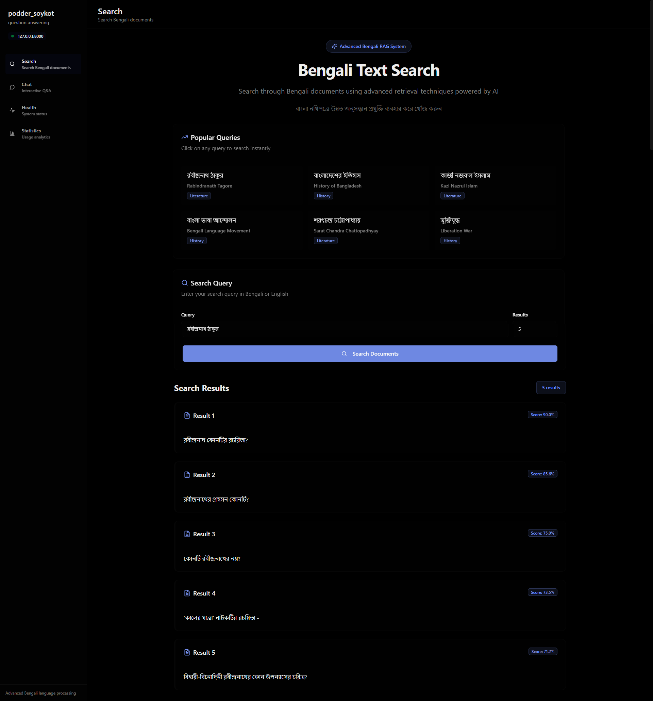
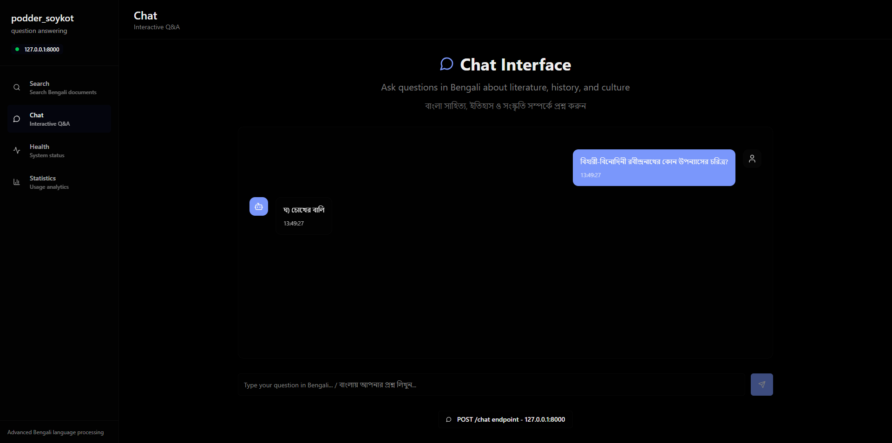
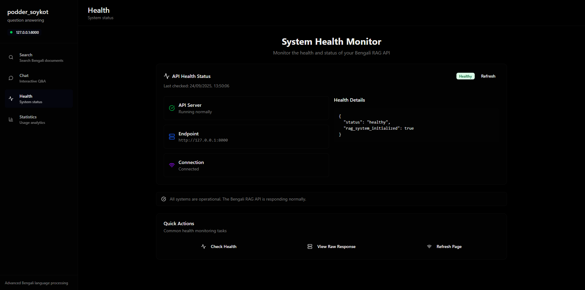
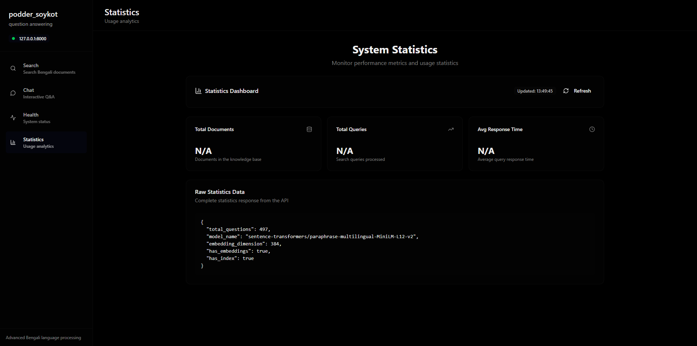

# Bengali RAG System



A Retrieval-Augmented Generation (RAG) system for Bengali literature questions using vector-based similarity search with SentenceTransformers.

---

## Badges


---

## Overview

This system implements a vector-based retrieval system that allows users to search through a dataset of Bengali literature questions and retrieve the most relevant questions and explanations. The system uses multilingual sentence transformers to create embeddings and provides both REST API and web interface for querying.

## Features

- **Vector-based Retrieval**: Uses SentenceTransformers for semantic search
- **Multilingual Support**: Handles Bengali text with proper preprocessing
- **REST API**: FastAPI-based API with `/search` endpoint
- **Web Interface**: HTML interface for easy querying
- **Evaluation Metrics**: Hit@1, Hit@3, Hit@5, and MRR evaluation
- **Docker Support**: Containerized deployment option
- **Persistent Embeddings**: Saves computed embeddings for faster startup

### Example Chat Interface



---

## Dataset

The system works with a CSV dataset containing Bengali literature questions with the following structure:
- **Question**: The main question text
- **Options**: Multiple choice options (Option 1-5)
- **Answer**: Correct answer
- **Explanation**: Detailed explanation
- **Difficulty**: Difficulty level
- **Other metadata**: ID, timestamps, etc.

Dataset size: ~500 questions (497 after cleaning)

## Usage

### Quick Start

1. **Initialize the system** (computes embeddings):
```bash
python scripts/run.py --mode init
```

2. **Run the API server**:
```bash
python -m uvicorn main:app --host 0.0.0.0 --port 8000
```

3. **Access the web interface**: Open http://localhost:8000

---

### Command Line Options

The `scripts/run.py` supports different modes:

- `--mode init`: Initialize system and compute embeddings
- `--mode api`: Start FastAPI server
- `--mode eval`: Run evaluation and generate report
- `--mode search`: Interactive search mode
- `--host HOST`: API server host (default: 0.0.0.0)
- `--port PORT`: API server port (default: 8000)

### API Usage

#### Search Endpoint

**GET** `/search?query=<search_term>&k=<number_of_results>`

Parameters:
- `query` (required): Search query text
- `k` (optional): Number of results to return (1-50, default: 5)

Example:
```bash
curl "http://localhost:8000/search?query=রবীন্দ্রনাথ ঠাকুর&k=3"
```

Response:
```json
{
  "query": "রবীন্দ্রনাথ ঠাকুর",
  "results": [
    {
      "rank": 1,
      "id": 215803,
      "question": "রবীন্দ্রনাথের \"গীতাঞ্জলী\" কাব্যগ্রন্থের ইংরেজি অনুবাদ করেন কে?",
      "answer": "3",
      "similarity_score": 0.95,
      "explanation": "..."
    }
  ],
  "total_results": 3,
  "system_stats": {...}
}
```

#### Health Check Example



---

### Web Interface

No bundled web UI. Use the Postman collection `api_collection.postman.json` or curl.

## Evaluation

### Running Evaluation

```bash
python scripts/run.py --mode eval
```

### Evaluation Metrics

The system evaluates retrieval performance using:

- **Hit@1**: Percentage of queries where the exact match is the top result
- **Hit@3**: Percentage of queries where the exact match is in top 3 results  
- **Hit@5**: Percentage of queries where the exact match is in top 5 results
- **MRR (Mean Reciprocal Rank)**: Average rank of first relevant result

### Current Results

Based on evaluation of 100 test questions:

- **Hit@1**: 8.0% (8/100)
- **Hit@3**: 9.0% (9/100)  
- **Hit@5**: 9.0% (9/100)
- **MRR**: 0.085

### System Statistics Example



---

### Qualitative Examples

Example queries and retrieved results are generated during evaluation to demonstrate system performance.

## System Architecture

### Core Components

1. **BengaliRAGSystem** (`app/core/rag_system.py`): Core retrieval system
   - Data loading and preprocessing
   - Text cleaning (removes HTML, normalizes Bengali text)
   - Embedding computation using SentenceTransformers
   - Vector similarity search using scikit-learn

2. **FastAPI Server** (`app/api/server.py`): REST API
   - Search endpoint with query parameters
   - System statistics and health endpoints

3. **Evaluation System** (`app/evaluation/evaluator.py`): Performance evaluation
   - Leave-one-out evaluation approach
   - Hit@K and MRR metric computation
   - Qualitative example generation

4. **CLI** (`scripts/run.py`): Initialization, evaluation, interactive search

### Technical Details

- **Model**: `sentence-transformers/paraphrase-multilingual-MiniLM-L12-v2`
- **Embedding Dimension**: 384
- **Similarity Metric**: Cosine similarity
- **Index**: Scikit-learn NearestNeighbors with brute force algorithm
- **Text Processing**: HTML tag removal, whitespace normalization, Bengali character preservation

## File Structure

```
Assignment_RagSystem/
├── app/
│   ├── __init__.py
│   ├── api/
│   │   ├── __init__.py
│   │   └── server.py              # FastAPI application (uvicorn app.api.server:app)
│   ├── core/
│   │   ├── __init__.py
│   │   └── rag_system.py          # Core RAG system
│   └── evaluation/
│       ├── __init__.py
│       └── evaluator.py           # Evaluation system
├── scripts/
│   └── run.py                     # CLI entry (init, api, eval, search)
├── main.py                        # ASGI entry (uvicorn main:app)
├── questions.csv                  # Dataset file
├── requirements.txt               # Python dependencies
├── Dockerfile                     # Docker configuration
├── docker-compose.yml             # Docker Compose configuration
├── embeddings.pkl                 # Computed embeddings (generated)
├── embeddings_index.pkl           # Nearest neighbors index (generated)
├── evaluation_results.json        # Evaluation results (generated)
└── README.md                      # This file
```

## Performance Notes

- **First Run**: Initial embedding computation takes ~2-3 minutes
- **Subsequent Runs**: Fast startup using cached embeddings
- **Memory Usage**: ~200MB for embeddings and model
- **Search Speed**: <100ms for typical queries

## Troubleshooting

### Common Issues

1. **"questions.csv not found"**: Ensure the CSV file is in the project directory
2. **Model download fails**: Check internet connection for Hugging Face model download
3. **Memory errors**: Ensure sufficient RAM for model loading (~2GB recommended)
4. **Port already in use**: Change port with `--port` parameter

### Dependencies

Key dependencies:
- `sentence-transformers`: For multilingual embeddings
- `fastapi`: Web framework
- `pandas`: Data manipulation
- `scikit-learn`: Vector similarity search
- `numpy`: Numerical operations

## Future Improvements

Potential enhancements:
- Hybrid retrieval (BM25 + embeddings)
- Reranking system for improved accuracy
- Answer generation using LLMs
- Better text preprocessing for Bengali
- Caching for improved performance
- Batch processing for multiple queries

## License

This project is created for educational and research purposes.